# WatchGarageDoor

**Version 2.0.0**

## Garage doors in wrist

With this application, you can conveniently control your garage doors from your wrist.
Made for Apple Watch with WatchOS 26.0 or later and runs independently without a companion app on iOS.

This application requires you to own a third-party [OpenGarage](http://opengarage.io) controller that is already setup and working in your local Wifi network.
Other controllers are not supported!

### Features

- Added support for OpenGarage Firmware API version 1.2.3
- watchOS 26.0 supported
- Control multiple garage door controllers
- Open and close the selected garage door
- Review status log for open/close actions
- Maintain settings for controllers
- Edit device list of controllers (move or delete)

### Requirements

In order to build this project you will need Xcode 26.0 or later and the Deployment Target must be set to WatchOS 26.0. 
OpenGarage Firmware API versions 1.1.0 thru 1.1.2 and 1.2.3 supported.

### Device Setup

When the device list is empty, you will see "Please, add a device" prompt.
Or you want to add another device, then select Setup on the toolbar to open a setup menu and
select New device to maintain its parameters (device name, IP address, Port, Device key (only needed for opening and closing),
number of log entries to show etc.). Once you save the settings, you should see the information about the new device.

If you want to change the device settings, tap the device on the device list to select it and see its status log.
On the status log list, select Options toolbar command to open an options menu for the selected device and select Settings to edit.

### Release Notes

  - Platform Updates: iOS 18.0 → 26.0, watchOS 11.0 → 26.0
  - SwiftUI Publisher Issues: Fixed all the willChange → objectWillChange transitions
  - Deprecated APIs: Updated locale APIs, onChange syntax, ForEach ranges
  - State Management: Fixed array mutation and binding issues
  - Digital Crown Crash: The sneaky culprit - invalid ranges in newer watchOS!

### Screenshots

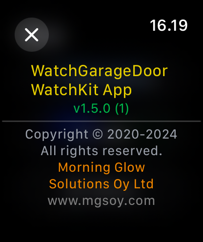
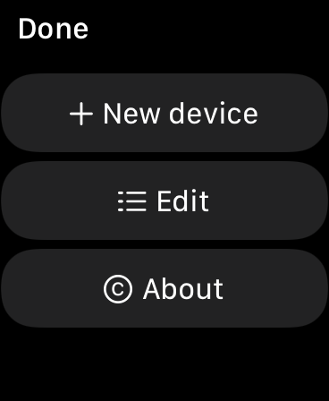
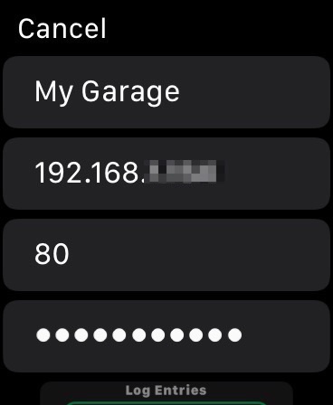
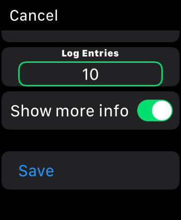
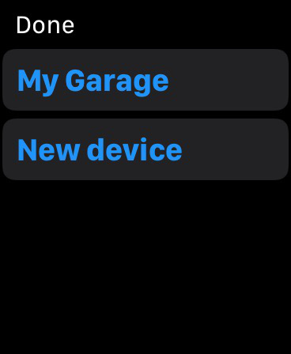
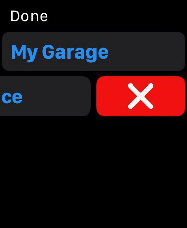
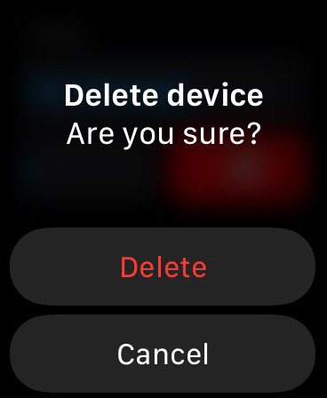
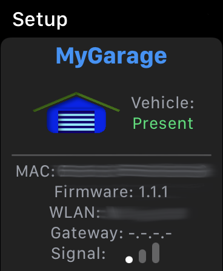
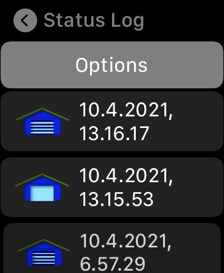
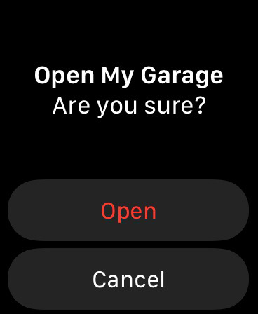
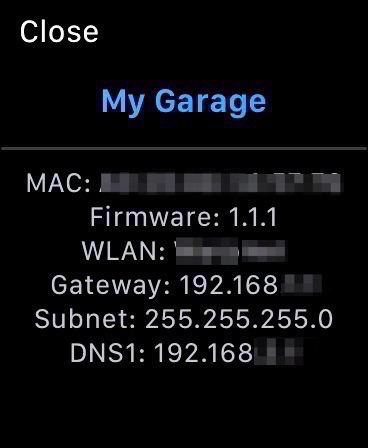

## License & copyright

© 2020-2025 [Morning Glow Solutions Oy Ltd](https://www.mgsoy.com/)

MIT License

Permission is hereby granted, free of charge, to any person obtaining a copy
of this software and associated documentation files (the "Software"), to deal
in the Software without restriction, including without limitation the rights
to use, copy, modify, merge, publish, distribute, sublicense, and/or sell
copies of the Software, and to permit persons to whom the Software is
furnished to do so, subject to the following conditions:

The above copyright notice and this permission notice shall be included in all
copies or substantial portions of the Software.

THE SOFTWARE IS PROVIDED "AS IS", WITHOUT WARRANTY OF ANY KIND, EXPRESS OR
IMPLIED, INCLUDING BUT NOT LIMITED TO THE WARRANTIES OF MERCHANTABILITY,
FITNESS FOR A PARTICULAR PURPOSE AND NONINFRINGEMENT. IN NO EVENT SHALL THE
AUTHORS OR COPYRIGHT HOLDERS BE LIABLE FOR ANY CLAIM, DAMAGES OR OTHER
LIABILITY, WHETHER IN AN ACTION OF CONTRACT, TORT OR OTHERWISE, ARISING FROM,
OUT OF OR IN CONNECTION WITH THE SOFTWARE OR THE USE OR OTHER DEALINGS IN THE
SOFTWARE.
